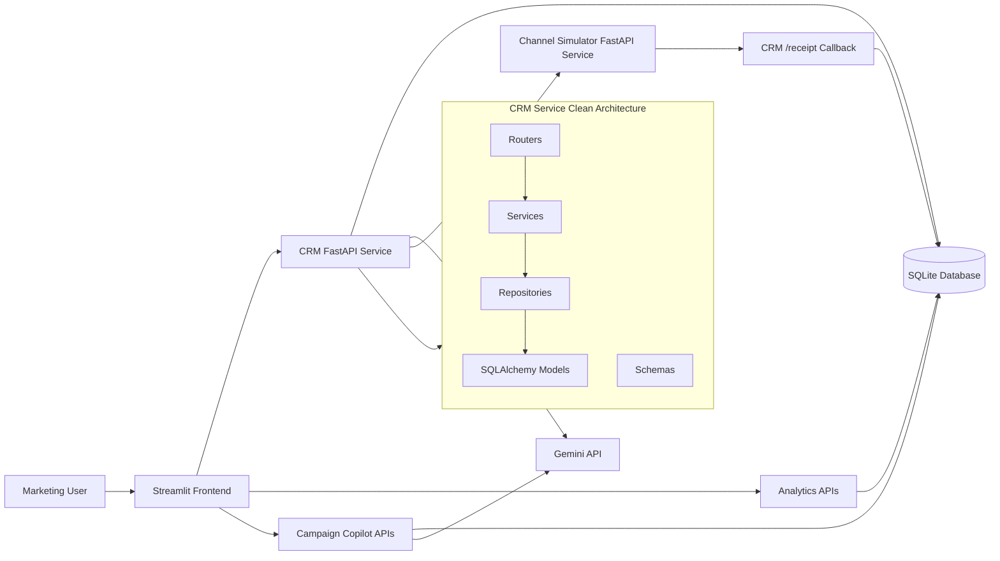

# Campaign Copilot Architecture Diagram

## Key Design Points

- Streamlit is the operator UI.
- FastAPI exposes CRM, AI planning, analytics, monitoring, and insights endpoints.
- SQLAlchemy models own the persistence layer.
- Gemini is isolated behind agents so the app still works with deterministic fallbacks.
- Channel Simulator runs as a separate FastAPI service and sends event callbacks to CRM.
- Analytics endpoints compute RFM, customer health, engagement, campaign success, and audience leaderboards.
